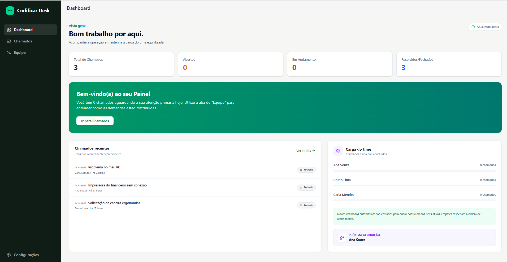
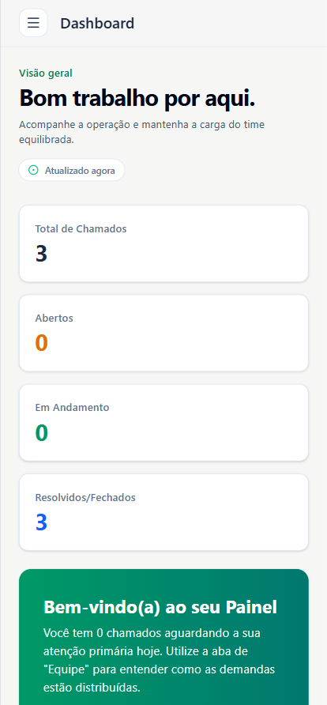
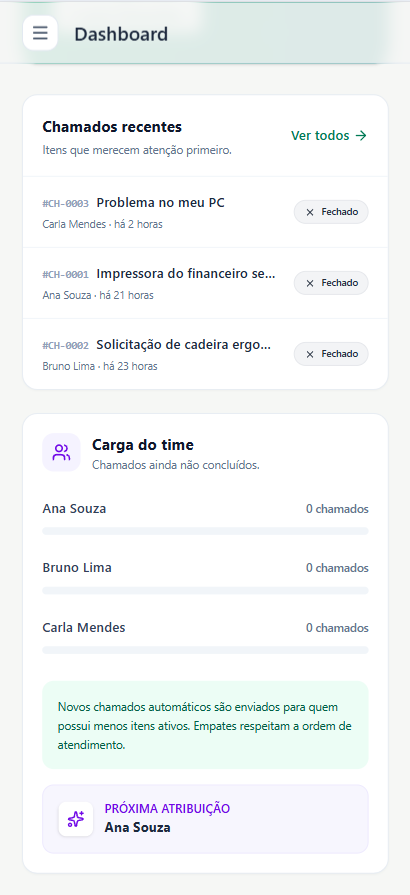

# Codificar Desk

Sistema de controle de chamados internos desenvolvido para o desafio técnico da Codificar. A solução centraliza solicitações que antes chegavam por canais dispersos e mantém o trabalho do suporte visível e equilibrado.

## Interface

### Desktop



### Mobile

<p align="center">
  
  
</p>

## Executar

Único requisito: Docker Desktop ou Docker Engine com Compose.

Windows:

```powershell
powershell -ExecutionPolicy Bypass -File .\scripts\build.ps1
```

Linux ou macOS:

```bash
./scripts/build.sh
```

A aplicação estará disponível em [http://localhost:3000](http://localhost:3000). O primeiro início cria o banco, aplica as migrations e inclui três responsáveis e dois chamados demonstrativos. O seed é idempotente.

Comandos úteis:

```powershell
powershell -ExecutionPolicy Bypass -File .\scripts\build.ps1 logs
powershell -ExecutionPolicy Bypass -File .\scripts\build.ps1 seed
powershell -ExecutionPolicy Bypass -File .\scripts\build.ps1 reset
powershell -ExecutionPolicy Bypass -File .\scripts\build.ps1 down
powershell -ExecutionPolicy Bypass -File .\scripts\test.ps1
```

Os equivalentes Unix usam `./scripts/build.sh` e `./scripts/test.sh`.

## Requisitos Atendidos

| Requisito | Implementação |
|---|---|
| Cadastrar chamados | Formulário validado com atribuição manual ou automática |
| Editar chamados | Edição preserva responsável e data de resolução quando não há comando explícito |
| Listar e visualizar | Lista responsiva, detalhes completos e estados vazios |
| Prioridade e status | Baixa, média, alta; aberto, em andamento, resolvido e fechado |
| Responsáveis | Seed inicial e gestão de cadastro, nome e remoção nas configurações |
| Distribuição automática | Menor carga ativa, desempate por rotação e proteção contra concorrência |
| Acompanhamento | Dashboard, filtros, busca, ordenação e ações rápidas de status |
| Execução local | Banco, migration, API, frontend e Nginx iniciados por Docker Compose |
| Qualidade | Testes unitários, integração PostgreSQL, concorrência, cliente frontend, vet, typecheck e CI |

## Experiência Operacional

- Dashboard com indicadores, carga do time e próximo responsável automático.
- Gestão da equipe com cadastro, renomeação e remoção protegida pelo histórico de chamados.
- Busca e filtros persistidos na URL, permitindo compartilhar a mesma visão.
- Ordenação por prioridade, abertura ou última atualização.
- Destaque para chamados de alta prioridade ou abertos há mais de 24 horas.
- Ações rápidas para iniciar, resolver, fechar ou reabrir um chamado.
- Feedback de sucesso e erro, skeletons e proteção contra perda de formulário.
- Interface responsiva, semântica e preparada para auditorias automatizadas de acessibilidade.

## Distribuição Automática

Chamados `open` e `in_progress` são considerados ativos. Chamados `resolved` e `closed` representam trabalho concluído e não entram no cálculo da carga.

A atribuição automática acontece em uma transação no PostgreSQL:

1. Os responsáveis ativos são bloqueados durante a seleção.
2. O sistema conta os chamados ativos de cada pessoa.
3. Escolhe quem possui a menor carga.
4. Em caso de empate, escolhe quem está há mais tempo sem receber uma atribuição automática.
5. Registra chamado e rotação antes de confirmar a transação.

O bloqueio impede que requisições simultâneas consultem a mesma carga e direcionem vários chamados para a mesma pessoa. Na edição, o responsável atual é preservado; uma nova distribuição só acontece ao trocar para o modo automático ou selecionar **Redistribuir agora**.

A data de resolução também segue a transição de estado: é criada ao concluir, preservada em edições posteriores e removida somente quando o chamado é reaberto.

## Arquitetura

```text
Navegador
   |
Nginx
   |
Vue 3 + TypeScript ---- tipos gerados pelo OpenAPI
   |
API HTTP em Go
   |
Serviço de chamados
   |
Repositório PostgreSQL
```

```text
client-web/                         frontend Vue
service-api/openapi.yaml            contrato HTTP
service-api/service-golang/         API, serviço e persistência Go
service-api/service-postgresql/     migrations e seed
infra/                              Docker Compose e Nginx
scripts/                            build, seed e validação
```

O projeto é um monólito modular. Essa abordagem mantém implantação e desenvolvimento simples para uma equipe pequena, sem misturar regras de negócio, transporte HTTP e persistência.

## Contrato HTTP

O arquivo [`service-api/openapi.yaml`](service-api/openapi.yaml) é a fonte do contrato entre backend e frontend. Os tipos TypeScript são gerados durante o build:

```bash
cd client-web
npm run generate:types
```

Isso evita manter manualmente dois conjuntos de modelos e torna mudanças incompatíveis visíveis no typecheck e na CI.

## Escolhas Técnicas

**Go e API HTTP:** Go faz parte das tecnologias utilizadas pela Codificar e oferece uma base pequena e direta. A API usa a biblioteca padrão e `pgx`, com uma camada de serviço para casos de uso e PostgreSQL para atomicidade.

**Vue 3 e TypeScript:** Vue também faz parte da stack da empresa. Composition API e tipos gerados pelo OpenAPI reduzem o atrito entre frontend e backend.

**PostgreSQL:** garante integridade dos estados e implementa corretamente a distribuição concorrente por meio de transações e bloqueios.

**Tailwind CSS:** permite construir uma interface consistente e responsiva sem manter uma biblioteca visual própria para este escopo.

**Docker Compose:** reduz a execução local a um comando e mantém banco, migration, API e frontend reproduzíveis.

## Validação

```powershell
powershell -ExecutionPolicy Bypass -File .\scripts\test.ps1
```

O comando:

- Cria um banco `chamados_test` isolado.
- Aplica as migrations reais.
- Executa testes unitários e de integração.
- Valida a distribuição com criações concorrentes.
- Executa `go vet`.
- Gera os tipos pelo OpenAPI.
- Testa pela interface o fluxo de criar, editar e concluir um chamado.
- Executa typecheck e build do frontend.
- Valida o Docker Compose.

A CI repete as mesmas verificações em cada push e pull request.

## Observabilidade

- `/health` verifica API e conexão com PostgreSQL.
- Logs estruturados em JSON.
- `X-Request-ID` para correlação de requisições.
- Método, rota, status HTTP e duração registrados por requisição.

## Escopo

Autenticação, anexos, comentários e notificações foram deixados de fora intencionalmente. Para esta primeira versão, eles aumentariam o volume sem melhorar a solução central: registrar, acompanhar e distribuir chamados com qualidade.

## Referências Externas

- [Go](https://go.dev/)
- [Vue.js](https://vuejs.org/)
- [Tailwind CSS](https://tailwindcss.com/)
- [PostgreSQL](https://www.postgresql.org/)
- [OpenAPI](https://spec.openapis.org/oas/latest.html)
- [Docker Compose](https://docs.docker.com/compose/)
- [Lucide Icons](https://lucide.dev/)
